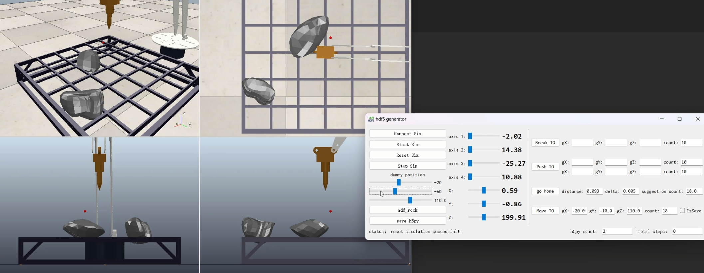

service_func.py : Used for the angle of view of  breaking excavator and saved as HDF5

imitate_episodes.py : Training and testing for imitation learning

sim/sim_scene_broken.ttt : Simulation environment for breaking of coppeliasim excavator

sim/rock/* : Pre segmented rock formations using Blender

### train
python imitate_episodes.py --task_name sim_ai_broken --ckpt_dir ./ --policy_class TMVDN --kl_weight 100 --chunk_size 100 --hidden_dim 512 --batch_size 8 --dim_feedforward 32 --num_epochs 1000 --lr 1e-5 --seed 0

### eval

python imitate_episodes.py --task_name sim_ai_broken --ckpt_dir ./ --policy_class TMVDN --kl_weight 100 --chunk_size 100 --hidden_dim 512 --batch_size 8 --dim_feedforward 32 --num_epochs 1000 --lr 1e-5 --seed 0 --eval

Expert demonstration collection

